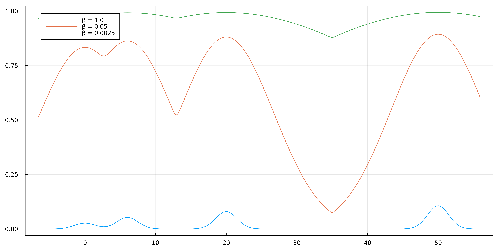

| :warning: WARNING          |
|:---------------------------|

This package is currently under development. Details below are subject to change.

# MCMCTempering.jl

This package offers a flexible family of methods for dealing with complex and multi-modal posteriors. These methods can augment standard MCMC samplers and kernels which may otherwise struggle to sample effectively in these situations, leading to poor mixing or only partial exploration of a posterior of interest.

So far, we have implemented a modular and extendable Adaptive Parallel Tempering (PT) meta-algorithm with options for choosing swap and adaptation strategies. PT leverages a temperature ladder and multiple parallel chains to "temper" the target log-density function to different degrees. The goal is to flatten out the target and build bridges for the most tempered chains to easily mix across isolated modes, before passing this information back down to the untempered "cold" target state.

We hope to offer multi-threaded and distributed implementations of this approach soon, as well as providing more cutting edge methods for helping solve situations where multi-modality and complexity pose barriers to inference.


## Using MCMCTempering

`MCMCTempering` stores temperature scheduling information in a special kind of `sampler`. In order to leverage this package's approaches, we can either:

1. call `tempered_sample` in place of the usual `sample` method provided by `AbstractMCMC`, we provide the usual arguments plus any tempering specific configuration; or
2. temper a sampler by calling the `tempered` function on any `sampler` that supports `MCMCTempering`, before passing this sampler to a `sample` call ourselves manually.

Below is an example use case, inclusive of the steps required to support `AdvancedMH`, and sample comparisons with and without application of this package:

```julia
using MCMCTempering

using AdvancedMH, AbstractMCMC, Distributions, LogDensityProblems, MCMCChains
using Random, LinearAlgebra
using Plots, StatsPlots

Random.seed!(123);

# Target of interest.
struct Problem end

# Gaussian Mixture Model with 4 components, one of which is very isolated from the rest
gmm = MixtureModel(
       Normal,
       [(0, 1.5), (6, 1.5), (20, 1.5), (50, 1.5)],
       [0.1, 0.2, 0.3, 0.4]
)

LogDensityProblems.logdensity(::Problem, x) = loglikelihood(gmm, x)
LogDensityProblems.dimension(::Problem) = 1
LogDensityProblems.capabilities(::Type{Problem}) = LogDensityProblems.LogDensityOrder{0}()

model = Problem();

# Make AdvancedMH.jl compatible with MCMCTempering.jl.
MCMCTempering.getparams(transition::AdvancedMH.Transition) = transition.params

# Set up our sampler with a joint multivariate Normal proposal.
sampler = RWMH(Normal());

# Set our temperature ladder and observe it with respect to the density
inverse_temperatures = MCMCTempering.check_inverse_temperatures(0.05 .^ [0, 1, 2])

sample = rand(gmm, 100_000)
x = minimum(sample):0.1:maximum(sample)
plot(x, hcat(collect(pdf.(gmm, x) .^ β for β in inverse_temperatures)...), labels = ["β = 1.0" "β = 0.05" "β = 0.0025"])
```



We can see that as we more severely temper the density, it approaches a uniform distribution, something most MCMC samplers find trivial to traverse.

```julia
# Next, we acquire a standard, non-tempered sample
chain = AbstractMCMC.sample(model, sampler, 1_000_000, chain_type=MCMCChains.Chains)

"""
Summary Statistics
  parameters      mean       std   naive_se      mcse         ess      rhat 
      Symbol   Float64   Float64    Float64   Float64     Float64   Float64 

     param_1    5.7010    5.8855     0.0059    0.1609   2525.9337    1.0980

Quantiles
  parameters      2.5%     25.0%     50.0%     75.0%     97.5% 
      Symbol   Float64   Float64   Float64   Float64   Float64 

     param_1   -2.1148    1.3748    5.3484    7.0577   21.1311
"""

plot(chain)
```


The standard approach taken above exhibits very poor mixing and does not succesfully explore all of the modes of the target. It also fails to accurately represent the modes it _does_ discover due to very poor mixing, despite the large number of steps taken.

```julia
tempered_chain = tempered_sample(
       model,
       sampler,
       1_000_000,
       inverse_temperatures;
       swap_strategy=MCMCTempering.ReversibleSwap(),
       chain_type=MCMCChains.Chains,
       swap_every=10
)

"""
Summary Statistics
  parameters      mean       std   naive_se      mcse         ess      rhat 
      Symbol   Float64   Float64    Float64   Float64     Float64   Float64 

     param_1   28.7887   19.4681     0.0229    0.4439   2750.0853    1.0015

Quantiles
  parameters      2.5%     25.0%     50.0%     75.0%     97.5% 
      Symbol   Float64   Float64   Float64   Float64   Float64 

     param_1   -0.6601    8.2885   21.0917   49.6947   52.3102
"""

plot(tempered_chain)
```


These results are much closer to the original target, showing that PT has managed to overcome the multi-modality problem posed by our model. Additionally, the mixing between modes has vastly improved, giving a much better representation of their respective weights in the GMM.

Note that equally, we could have `tempered` the `sampler` and then called `sample` on it as normal:

```julia
tempered_sampler = tempered(
       sampler,
       inverse_temperatures;
       swap_strategy=MCMCTempering.ReversibleSwap(),
       swap_every=10
)
tempered_samples = AbstractMCMC.sample(model, tempered_sampler, 1_000_000)
tempered_chain = MCMCTempering.prepare_tempered_chain(
       tempered_samples, model, sampler, 1_000_000; chain_type=MCMCChains.Chains
)
```

Hopefully, this package can help solve your sampling woes too!


## Supporting MCMCTempering

This package can easily be extended to support any sampler conforming to the lightweight `AbstractMCMC` interface.

### The simple way

`AbstractMCMC.step` returns two things: a `transition` representing the state of the Markov chain, and a `state` representing the full state of the sampler. These are both kept track of internally and used by MCMCTempering.jl, and MCMCTempering.jl just needs a tiny bit of information on how to interact with these (in particular the former of these).

First we need to implement `MCMCTempering.getparams(transition)` so `MCMCTempering` knows how to extract parameters from the state of the Markov chain. Maybe it looks something like:

```julia
MCMCTempering.getparams(transition::MyTransition) = transition.θ
```

If your `model` type already implements [`LogDensityProblems.jl`](https://github.com/tpapp/LogDensityProblems.jl), that's it; **you're done!**

If it doesn't, then you also need to implement the following two methods:

```julia
MCMCTempering.logdensity(model, x) = ...                # Compute the log-density of `model` at `x`.
MCMCTempering.make_tempered_logdensity(model, β) = ...  # Return a tempered `model` which can be passed to `logdensity`.
```

Once that's done, you're good to go!

### Improving performance

When we're proposing a swap between the Markov chain targeting `model_left` with some temperature `β_left` and the chain targeting `model_right` with temperature `β_right`, we need to compute the following quantities (with the current realizations denoted `x_left` and `x_right`):

```julia
logdensity(model_left, x_left)
logdensity(model_right, x_right)
logdensity(model_left, x_right)
logdensity(model_right, x_left)
```

which can be computationally expensive. 

_But_ often the `transition` contains not only the current realization but also the log-density at that realization. In the above case, that means that for the first two quantities, i.e. `logdensity(model_left, x_left)` and `logdensity(model_right, x_right)`, we can just extract these from the corresponding Markov chain states `transition_left` and `transition_right`!

To make use of such cached computations, one has to explicitly implement `MCMCTempering.compute_tempered_logdensities`:

```julia
help?> MCMCTempering.compute_tempered_logdensities
  compute_tempered_logdensities(model, sampler, transition, transition_other, β)
  compute_tempered_logdensities(model, sampler, sampler_other, transition, transition_other, state, state_other, β, β_other)

  Return (logπ(transition, β), logπ(transition_other, β)) where logπ(x, β) denotes the log-density for model with
  inverse-temperature β.

  The default implementation extracts the parameters from the transitions using getparams and calls logdensity on the model
  returned from make_tempered_model.
```

Here one can just extract the corresponding quantities instead of computing them, and thus avoiding two additional calls to `logdensity(model, x)`.

Temper away!
